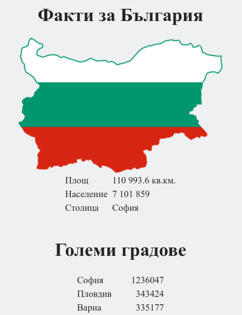

# BGApp

A simple web application that lists the top 10 cities in Bulgaria by population.

Used mostly for demonstration in various courses and presentations.

Contains the following set of files:

```
.
├── db                        ---> database image files
|   └── db_setup.sql          ---> database seed file
├── web                       ---> web image files
|   ├── bulgaria-map.png      ---> map of Bulgaria
|   ├── config.php            ---> main app config file
|   └── index.php             ---> main app file
├── .env                      ---> used in compose files
├── bgapp.png                 ---> preview of the application
├── Dockerfile.db             ---> used to build the database image
├── Dockerfile.web            ---> used to build the web image. Application files should be mounted on start
├── Dockerfile.web.embedded   ---> used to build the web image with embedded application files
├── README.md                 ---> this file
├── docker-compose-swarm.yaml ---> compose file for Docker Swarm
└── docker-compose.yaml       ---> compose file for standalone Docker
```

Published images can be found here:

- db component - <https://hub.docker.com/repository/docker/shekeriev/bgapp-db>

- web component - <https://hub.docker.com/repository/docker/shekeriev/bgapp-web>

Images can be build with the following commands:

```bash
# Build the database image
docker image build -t bgapp-db -f Dockerfile.db .

# Build the web image without embedded files
docker image build -t bgapp-web -f Dockerfile.web .

# Build the web image with embedded files
docker image build -t bgapp-web:embedded -f Dockerfile.web.embedded .

```

Containers can be run with the following commands:

```bash
# Run the database component
docker container run -d --name db --net app-net -e MYSQL_ROOT_PASSWORD=<some-pass> bgapp-db

# Run the web component without embedded (or with external) files
docker container run -d --name web --net app-net -p 8000:80 -v $(pwd)/web:/var/www/html bgapp-web

# Run the web component with embedded files
docker container run -d --name web --net app-net -p 8000:80 bgapp-web:embedded

```

Note that both containers should be attached to the same network to have working name resolution. The above sample commands expect the presense of the ***app-net*** network.

When built and deployed correctly, the result should look like this:


